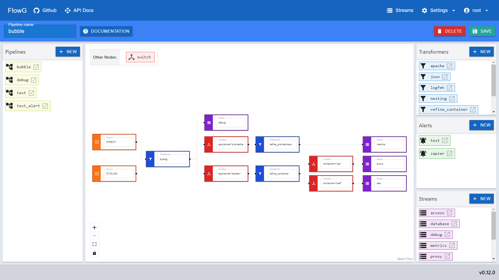
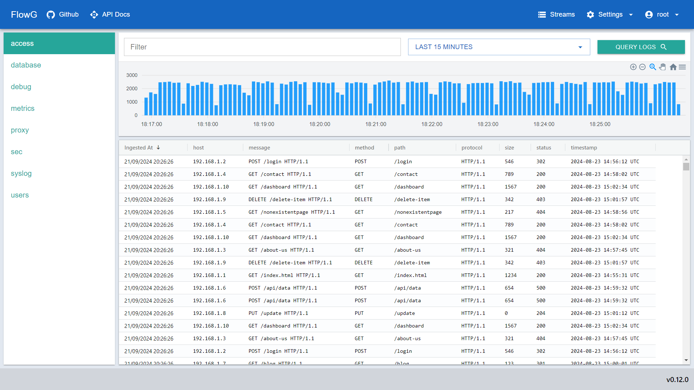

# FlowG

[](https://github.com/link-society/flowg/actions/workflows/build.yml)

FlowG is a log management platform that lets you ingest, transform, and query
logs using a visual pipeline builder. It handles structured logs without
requiring predefined schemas and relies on
[BadgerDB](https://dgraph.io/docs/badger/) as its storage backend.

For more informations, consult the [documentation](./docs/README.md).

You wish to contribute? Please read our [guidelines](./CONTRIBUTING.md) first.

## :sparkles: Key Features

 - **Pipelines:** Build and manage log processing pipelines visually, with
   support for transormations with [VRL](https://vector.dev/docs/reference/vrl/)
   scripts and conditional routing to dedicated streams
 - **Dynamic Logs:** Manage logs with varying structures without needing
   predefined schemas
 - **Interoperability:** Configuration and log ingestion can entirely be done
   via the REST API
 - **Observability:** Query and visualize logs in real-time in the integrated
   Web interface





## :question: Why should I use this?

**FlowG**'s primary goal is to make log refinement and routing as easy as
possible. As such, it relies on [React Flow](https://reactflow.dev) to help you
build such pipelines with as little code as possible. For the actual code part,
we use the [Vector Remap Language](https://vector.dev/docs/reference/vrl/),
which gives a solid base for log refinement.

It aims to replace tools like [Logstash](https://www.elastic.co/logstash) by
integrating the feature right in the solution.

It also leverages [BadgerDB](https://dgraph.io/docs/badger/) which is a battle
tested Key/Value database, with the right feature set to easily support indexing
dynamically structured logs, as well as log compression.

## :zap: Benchmark

Run with (see *Build* section bellow):

```
$ task build
$ task bench
```

System:

 - **CPU:** 13th Gen Intel(R) Core(TM) i7-13700K
 - **RAM:** 64GB

Result:

 - **Total requests sent:** 1,000,000
 - **Total time:** 481.65s
 - **Average:** 2076.18 request/s

## :warning: Disclaimer

This project is in a very early stage of development, as such:

 - it has not been tested in production
 - not even an automated test suite

Those points will be improved on given enough time.

## :construction: Build

**Requirements:**

 - Go 1.22+
 - C Toolchain
 - Rust and Cargo (edition 2021)
 - NodeJS

```bash
go install github.com/go-task/task/v3/cmd/task@latest
task build
```

Then, start the server with:

```bash
./bin/flowg serve \
  --auth-dir ./data/auth \
  --log-dir ./data/logs \
  --config-dir ./data/config  \
  --bind 127.0.0.1:5080
```

Now, you can access:

 - the WebUI at http://localhost:5080
 - the API documentation at http://localhost:5080/api/docs

A default user `root` (password: `root`) and a default pipeline are bootsrapped
if no configuration exists during startup.

## :whale: Build the Docker Image

```bash
task docker:build
```

This will build `linksociety/flowg:latest` locally.

Then, start the server with:

```bash
docker run -p 5080:5080 -v flowg-data:/data linksociety/flowg:latest
```

## :memo: License

This software is released under the terms of the [MIT License](./LICENSE.txt)
