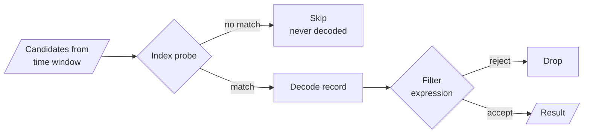

:tada:
**[FlowG v0.61.0](https://github.com/link-society/flowg/releases/tag/v0.61.0)**
has been released, and with it one of the two big projects we announced on the
[road to 1.0](/blog/road-to-stable#replication): **replication** is now
generally available.

It is powered by a brand new storage backend, built on top of
[FoundationDB](https://www.foundationdb.org/).

<!-- truncate -->

## A little bit of history

Historically, **FlowG** stored everything in [BadgerDB](https://dgraph.io/docs/badger/),
an embedded key/value store. It served us well, but it is a single-node
database, and our first attempt at replication was an experimental layer on top
of it, synchronizing storages via the "TCP Push/Pull" mechanism of the
[SWIM Protocol](https://en.wikipedia.org/wiki/SWIM_Protocol).

The idea was to let *every* node accept writes and reconcile them in the
background, converging towards
[eventual consistency](https://en.wikipedia.org/wiki/Eventual_consistency). Node
discovery was handled by
[Hashicorp's `memberlist`](https://github.com/hashicorp/memberlist), which we
ran over HTTP instead of its default TCP/UDP transport, so it could sit behind a
reverse proxy and reuse the same TLS and authentication as the rest of **FlowG**.

For the data synchronization itself, we leaned on a happy accident of BadgerDB:
it versions every key/value pair and exposes an *incremental backup* that streams
every pair newer than a given version and hands back the new high-water mark.
Each of our three storages already behaved like a
[CRDT](https://en.wikipedia.org/wiki/Conflict-free_replicated_data_type) anyway
(last-write-wins for `auth` and `config`, append-only for `log`), so we did not
even need the operation log we had originally designed. Once per second, riding
on the SWIM "TCP Push/Pull", each node advertised the last version it had seen
from every peer; the peer streamed back everything newer over HTTP (abusing
[HTTP trailers](https://developer.mozilla.org/docs/Web/HTTP/Reference/Headers/Trailer)
to send the new version *after* the body), and the receiver merged it straight
into its local storage.

As I said back then, this implementation was *"buggy, costly in terms of
performance, and wrong on many levels"*.

Making it *correct* would have meant piling on ever more machinery (snapshots
to keep the sync affordable, real conflict resolution, a story for network
partitions and node failures) until we had, slowly but surely, reimplemented a
distributed database. Badly.

So we did the reasonable thing: instead of writing our own, we stood on the
shoulders of giants and plugged **FlowG** into
[FoundationDB](https://www.foundationdb.org/), a distributed, transactional
key/value store that gives us replication, fault-tolerance and strict
serializability for free.

To understand how we got there, we first need to talk about how **FlowG** models
its data.

## The data model of FlowG

At the highest level, **FlowG** manipulates a handful of entities: users, roles
and their tokens for authentication; transformers, pipelines and forwarders for
processing; and streams of log records for storage.

Here is how they relate to each other, grouped by the store they live in:

<div style={{display: 'flex', flexWrap: 'wrap', gap: '1rem', justifyContent: 'center', alignItems: 'flex-start'}}>
<div style={{flex: '1 1 220px', minWidth: 0}}>


</div>
<div style={{flex: '1 1 220px', minWidth: 0}}>


</div>
<div style={{flex: '1 1 220px', minWidth: 0}}>


</div>
</div>

Those are the *logical* entities, the ones you manipulate through the API and
the UI. But under the hood, **FlowG** does not know about "users" or "streams".
It only knows about **key/value pairs**.

### From entities to key/value pairs

Every entity is decomposed into a set of key/value pairs, spread across three
independent, ordered stores: the `auth`, `config` and `log` namespaces. A single
logical entity is not one row, it lives in several keys that share a common
prefix. Its attributes become key suffixes, and its relationships become keys of
their own: the key `user:alice:role:admin` simply *means* "alice has the role
admin". When a key's mere presence already carries the information, it stores no
value at all (we write those `∅`).

#### `auth` (users, roles, tokens)

<div style={{textAlign: 'center'}}>


</div>

<div style={{textAlign: 'center'}}>


</div>

<div style={{textAlign: 'center'}}>


</div>

#### `config` (transformers, pipelines, forwarders)

<div style={{textAlign: 'center'}}>


</div>

<div style={{textAlign: 'center'}}>


</div>

<div style={{textAlign: 'center'}}>


</div>

#### `log` (streams and their records)

<div style={{textAlign: 'center'}}>


</div>

<div style={{textAlign: 'center'}}>


</div>

The ordering of the keys is not incidental, it is load-bearing. Everything under
the `user:alice:` prefix sits contiguously, so reading a user back is a single
prefix scan. The same property is what lets us store each log entry under a
timestamped key and scan a whole stream in chronological order, and keep an
inverted index of field values right beside the entries it points to.

### Operations as ACID transactions

Because a single entity spans several keys, any operation on it has to touch
several keys at once, and they must all take effect together or not at all. That
is exactly what a transaction gives us.

Saving the user `alice` above, for instance, is not a single write. It stores her
password, adds the roles she should have, and removes the ones she should no
longer have, all inside one read-write transaction.

If any of these writes fails, the whole transaction is rolled back as if it never
happened: `alice` never ends up with only half of her roles, and a concurrent
reader sees either her old state or her new one, never something in between.
Reads work the same way, running in read-only transactions over a consistent
snapshot.

This is the important takeaway: **FlowG only ever needs two primitives from its
storage layer** (a read-only transaction and a read-write transaction, both
providing get, set, delete, and ordered prefix iteration over key/value pairs).

Anything that can provide *that*, with ACID guarantees, can be a backend for
**FlowG**.

### About indexing

Those two primitives are enough to *store* logs. Making them fast to *query* is a
different story, and it is really the log key layout that does the heavy lifting
there, so it is worth zooming in.

A log record lives under a key like `entry:<stream>:<timestamp>:<id>`. The
timestamp is zero-padded, so keys sort chronologically, and a time-range query
never has to scan a whole stream: it seeks straight to the lower bound and stops
the moment a key sorts past the upper bound. Filtering by time is, essentially,
free.

Filtering by *field value* is where it gets interesting. The obvious way to do it
is to take every record in the time window, decode its JSON, and keep the ones
whose field matches. It works, and it is exactly what we did at first, but it
pays a full deserialization for every candidate (including all the ones we are
about to throw away). On a busy stream, that is a lot of wasted work for a query
that might return a handful of rows.

So, for the fields a stream is configured to index, we keep an inverted index
right next to the entries, stored (like so many other things in **FlowG**) as
bare existence markers with no value (our friend `∅` again):

```
index:<stream>:field:<field>:<value>:<entry-key…>
```

Every segment of that key is there for a reason. The `<field>` and `<value>`
segments identify the *(field, value)* pair, and the trailing `<entry-key…>` is
the full key of the record this marker points back to. Baking the entry key into
the index key is what lets us later ask, in a single `O(1)` lookup, "does *this*
record carry *this* value?" without scanning anything. Each of those index keys is
also written with the record's TTL, so it expires alongside the entry, and the
garbage collector clears it on eviction.

The separators shown here as `:` are, on disk, the ASCII `ESC` byte (`0x1b`).
They used to be an actual `:`, and back then the field value had to be
base64-encoded before going into the key, so a value containing a `:` could not
smuggle a fake separator in and break the key structure. Switching the separator
to `ESC` (a control byte that simply never shows up in a real field value) made
that dance unnecessary, so values now go in as-is. The base64 encoding still
lingers in the code for historical reasons, but it no longer earns its keep.

Given a filter on an indexed field, the candidate set comes entirely from the
time window: we prefix-scan the `entry:<stream>` keyspace bounded to `[from, to]`
and get every entry key in that range, newest first.

What the index buys us is the ability to reject a candidate *without decoding it*.
For each candidate entry key, and each field in the filter, we rebuild the exact
index key (the `(field, value)` prefix followed by *that entry's own key*) and do
a single existence check. Because the entry key is baked into the index key, this
is an `O(1)` "does *this* record carry *this* value?" probe, not a scan. A field
passes if any of its requested values probes true (OR within a field), and a
candidate survives only if every filtered field passes (AND across fields).

Only the survivors are actually fetched and JSON-decoded, and only then do we hand
them to the (more expensive) filter expression for whatever the index cannot
express:



The point is that the expensive part (reading and deserializing records) now runs
only on the entries that already passed the cheap existence probes, instead of on
every record in the window.

The same layout gives us one more thing almost for free: listing the *distinct
values* of an indexed field, say to populate a filter dropdown in the UI, reads
those values straight out of the index keys, without opening a single record.

> **NB:** This is why the value lives *inside the key* rather than beside it: an
> index key we can existence-check by entry is worth far more here than a value
> we would have to open and read. It is also what makes the ~7 KB indexing ceiling
> (from the key-size limit above) a deliberate, acceptable trade-off rather than
> an oversight.

## Mapping the model to BadgerDB

[BadgerDB](https://dgraph.io/docs/badger/) was our first, and until now only,
implementation of that contract. It is an embedded, LSM-tree based key/value
store, and it maps almost one-to-one onto our needs:

 - read-only and read-write transactions
 - ordered iteration over key prefixes
 - **native TTL**, which we use for log retention: a record simply expires on
   its own
 - **streaming backup and restore**, which back our backup/restore API

The pros are compelling:

 - **zero operational overhead**: it is a library, not a server. **FlowG** ships
   as a single binary with no external dependency.
 - **fast**: everything is local, no network round-trip.
 - **simple**: a directory on disk is your whole database.

But there is one fundamental limitation, and it is a big one:

 - **it is single-node**. BadgerDB has no notion of replication or high
   availability: the whole database lives on a single machine, and only one
   process can open it at a time.

For a log processing engine that you want to run in production, "single-node"
means "single point of failure". And that is exactly what replication is meant
to solve.

## Enter FoundationDB

[FoundationDB](https://www.foundationdb.org/) is a distributed, ordered
key/value store with **ACID transactions** and **strict serializability**. It is
the database that famously
[survives being tortured](https://apple.github.io/foundationdb/testing.html) by
its own deterministic simulation testing, and it powers, among others, Apple's
iCloud.

Crucially, its data model is *exactly* the abstraction **FlowG** already speaks:
ordered key/value pairs, mutated inside transactions. Replication,
fault-tolerance and failover are handled by FoundationDB itself, transparently.

This is also what fixes our first attempt at replication. Back then, every node
kept its own private BadgerDB and we tried to synchronize them after the fact,
which gave us [eventual consistency](https://en.wikipedia.org/wiki/Eventual_consistency)
at best, and nodes that quietly disagreed at worst. With FoundationDB, all nodes
read and write the *same* strictly-serializable database. There is a single
source of truth: a write acknowledged on one node is immediately visible on every
other one, with no reconciliation and no conflict resolution left for us to get
wrong.

Mapping our model onto it was mostly a matter of translation:

 - each of our three namespaces (`auth`, `config`, `log`) becomes a FoundationDB
   [subspace](https://apple.github.io/foundationdb/developer-guide.html#subspaces),
   e.g. `flowg/config`. The subspace prefix is transparently prepended on write
   and stripped on read, so **FlowG** only ever sees its own logical keys.
 - our composite keys (tuples of strings) are packed with the FoundationDB
   [tuple layer](https://apple.github.io/foundationdb/data-modeling.html#tuples),
   which **preserves lexicographic ordering**. This is essential: it is what
   keeps our chronological scans over log entries working.
 - our read-only and read-write transactions map straight onto FoundationDB
   transactions, which additionally retry themselves automatically on conflict.

A read-only transaction and a read-write transaction: the exact same two
primitives BadgerDB gave us. The engine above the storage layer did not have to
change at all.

There are, of course, some differences to reconcile. Two of them are worth a
dedicated section.

### Implementing TTL

Log retention relies on entries (and their index keys) expiring after a
configured amount of time. BadgerDB gave us this for free with native TTL.

FoundationDB, on the other hand, **has no native TTL**. So we implement it
ourselves.

Every value we store is wrapped in a small envelope: an 8-byte expiration
timestamp, followed by the actual payload.

<div style={{textAlign: 'center'}}>


</div>

Expiration is then enforced in two complementary ways:

 - **lazily, on read**: whenever we `Get` a key or iterate over a prefix, we
   decode the expiry header and simply skip (and treat as absent) any entry
   whose timestamp is in the past. An expired key is invisible to **FlowG**, even
   if it is still physically present.
 - **eventually, in the background**: a periodic garbage collector scans for
   expired keys and physically deletes them to reclaim disk space.

The result is a TTL that behaves, from the outside, just like BadgerDB's.

### Key/value size limits

BadgerDB was happy to store keys and values of just about any size. FoundationDB
is not: it enforces
[hard limits](https://apple.github.io/foundationdb/known-limitations.html) on the
byte size of every key and value a transaction writes, and blowing past them
aborts the **whole** commit with an opaque error.

Rather than let that failure surface deep inside the FoundationDB adapter, we
lifted these limits into the storage contract itself, so every backend (BadgerDB
included) now agrees on what it will accept:

 - keys are capped at **10 KB**
 - values are capped at **100 KB**

Any mutation that exceeds one of these is rejected up front with a typed error
(`ErrKeyTooLarge` / `ErrValueTooLarge`) instead of failing halfway through a
commit. Because BadgerDB now plays by the same rules, a payload that is accepted
on one backend behaves identically on the other (no nasty surprise the day you
switch from single-node to a cluster).

There is one more subtle consequence, this time for **log indexing**. When a
stream indexes a field, **FlowG** stores an inverted-index entry whose *key*
embeds the field's value:

```
index:<stream>:field:<field>:<base64(value)>:<entry-key...>
```

Since the value lives inside the key, a large enough value pushes the whole index
key past the 10 KB key limit. The value is base64-encoded (which inflates it by
roughly a third) and sits alongside the stream name, field name and the
referenced entry key, so in practice a field **value larger than ~7 KB can no
longer be indexed**.

We handle this gracefully: ingestion catches the `ErrKeyTooLarge`, logs a
warning and simply skips indexing that one value. The record is still stored and
still queryable by time (it just won't match an exact-value filter on that
oversized field).

> **NB:** This only affects the *index*, never the data. Your log records are
> stored whole; the only thing you lose on an oversized field is the ability to
> filter on its exact value (which, for a 7 KB blob, was never a very useful
> query to begin with).

### Backup and restore: the one thing we gave up

With BadgerDB, we implemented the backup/restore API by streaming the whole
database in and out.

FoundationDB's client API exposes **no such snapshot-streaming or bulk-load
primitive**. So, honestly, when running on FoundationDB, **FlowG** does not
support backup/restore through its own API at all.

This is not a regression you should worry about, though: FoundationDB comes with
its own, far more capable, backup tooling. Backups are meant to be taken
out-of-band with
[`fdbbackup`](https://apple.github.io/foundationdb/backups.html) and restored
with `fdbrestore`:

```bash
# Take a backup to a local directory
fdbbackup start -d file:///var/backups/flowg --wait

# Restore it into a (fresh) cluster
fdbrestore start -r file:///var/backups/flowg --wait
```

:::note[Online backup & restore]

These are **online** operations. `fdbbackup` runs while the cluster keeps serving
reads and writes, so it requires no downtime, and `fdbrestore` loads into a
running (usually fresh) cluster.

:::

> **NB:** These operate on the whole FoundationDB cluster, which is exactly what
> you want when **FlowG** shares a cluster or runs against a managed one. Refer
> to the [FoundationDB backup documentation](https://apple.github.io/foundationdb/backups.html)
> for the full picture, including continuous backups and point-in-time restore.

## Conclusion

Replication was the last big blocker on the road to a highly-available **FlowG**,
and rather than rolling our own distributed database, we let a battle-tested one
do the heavy lifting.

Because our storage layer was already expressed in terms of transactional
key/value operations, swapping BadgerDB for FoundationDB was a matter of writing
a new adapter, not rewriting the engine. BadgerDB remains the default for
single-node, zero-dependency deployments; FoundationDB is there when you need
replication and high availability.

Head over to the
[clustering guide](https://flowg.cloud/docs/user/advanced/cluster) to give it a
try, and as always, any feedback is welcome, either on
[GitHub](https://github.com/link-society/flowg) or on
[Discord](https://discord.com/invite/zjG3mMaENg).
