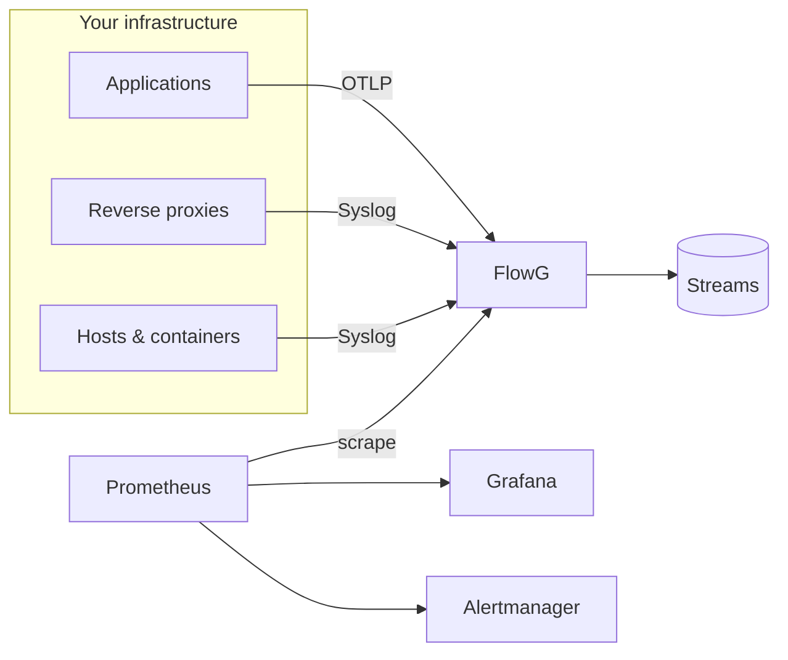

Logs tell you *what happened*. Metrics tell you *how much*, *how often*, and
*is it getting worse*. Most infrastructures pay for both, twice, with two
different agents reading the same lines.

Since **FlowG v0.62.0**, they can share the work: a pipeline is now able to
count the records flowing through it, and expose those counters to Prometheus.

<!-- truncate -->

## Two questions, two costs

> Show me the stack trace of the request that failed at 14:32

This is a question for logs. You need the full payload, and you need it exactly
once.

> Did the error rate of the checkout service triple in the last ten minutes?

This is a different question entirely. You do not need a single log line to
answer it, you need one number, sampled regularly. And yet, in most setups,
that question is answered by running a text search over hundreds of gigabytes,
every thirty seconds, on a dashboard nobody is looking at.

That is the expensive way of doing it.

The interesting part is that **FlowG** already has the answer. Your pipeline
parses every record, splits it, classifies it, decides that *this* one is an
error coming from *that* component, and then routes it to a stream. All that
classification work is done, and then thrown away.

Metric nodes let you keep a cheap, numeric shadow of it.



## The metric node

A [metric node](/docs/technical/pipelines/nodes/metric) does exactly one thing:
it increments a counter for every record that reaches it. Its only configuration
is a name.

It is a **terminal node**, like routers and forwarders: records go in, nothing
comes out. So you do not insert it *in* your flow, you branch off it. Any node
can fan out to a router *and* to one or more metric nodes, and the record is
processed by all of them concurrently.

Here is a pipeline that stores everything, and counts a few things on the side
(syslog severity `3` being *error*):

import PipelineDiagram from '@site/src/components/PipelineDiagram'

<PipelineDiagram
  alt="A FlowG pipeline where the SYSLOG source fans out to a router and to three switch nodes, each ending in a metric node"
  nodes={[
    { id: 'syslog', type: 'source', x: 0, y: 190, value: 'SYSLOG' },
    { id: 'sw-error', type: 'switch', x: 340, y: 0, value: 'severity == "3"' },
    { id: 'sw-nginx', type: 'switch', x: 340, y: 120, value: 'tag == "nginx"' },
    { id: 'sw-sshd', type: 'switch', x: 340, y: 240, value: 'tag == "sshd"' },
    { id: 'router', type: 'router', x: 340, y: 380, value: 'logs' },
    { id: 'm-error', type: 'metric', x: 680, y: 0, value: 'errors_total' },
    { id: 'm-nginx', type: 'metric', x: 680, y: 120, value: 'nginx_logs_total' },
    { id: 'm-sshd', type: 'metric', x: 680, y: 240, value: 'sshd_logs_total' },
  ]}
  edges={[
    { from: 'syslog', to: 'sw-error' },
    { from: 'syslog', to: 'sw-nginx' },
    { from: 'syslog', to: 'sw-sshd' },
    { from: 'syslog', to: 'router' },
    { from: 'sw-error', to: 'm-error' },
    { from: 'sw-nginx', to: 'm-nginx' },
    { from: 'sw-sshd', to: 'm-sshd' },
  ]}
/>

The name you pick becomes the metric name, prefixed with the `node` namespace:
`errors_total` is exported as `node_errors_total`.

:::note

Prometheus conventions still apply, and nothing enforces them for you. Suffix
your counters with `_total`, keep them in `snake_case`, and pick a naming
*scheme* rather than naming each node ad-hoc: here, every per-component counter
is called `<component>_logs_total`. We will exploit that scheme in a minute.

:::

## The per-pipeline exporter

Every pipeline exposes its own Prometheus exporter:

```bash
curl -s \
  -H "Authorization: Bearer ${FLOWG_TOKEN}" \
  http://localhost:5080/api/v1/pipelines/ingress/metrics
```

```
# HELP pipeline_logs_total Total number of logs processed by the pipeline since startup
# TYPE pipeline_logs_total counter
pipeline_logs_total 128374
# HELP node_errors_total Number of logs measured since startup
# TYPE node_errors_total counter
node_errors_total 812
# HELP node_nginx_logs_total Number of logs measured since startup
# TYPE node_nginx_logs_total counter
node_nginx_logs_total 96110
```

Two things to notice.

First, `pipeline_logs_total` is there for free. You do not have to draw anything
to get the total volume of a pipeline.

Second, the endpoint is **authenticated**, and requires the `read_pipelines`
scope. It lives on the regular API, not on the management interface. This is
deliberate: the `/metrics` endpoint on port `9113` is about monitoring
**FlowG itself** (goroutines, heap, ingestion counters), while the per-pipeline
exporter is about monitoring **the infrastructure FlowG collects logs for**.
Different audiences, different blast radius, different firewall rules.

:::note Counters are in-memory

They start at zero when the pipeline is built, which happens on server startup
and every time you save the pipeline. Prometheus detects counter resets on its
own, so `rate()` and `increase()` stay correct across restarts, just do not
build anything on the raw counter value.

:::

## Wiring the whole thing

Let's build the stack. First, a scraper identity: a role with the single scope
it needs, a user bound to that role, and a personal access token.

```bash
# create the role and the user through the UI or the API, then:
flowg-client token create
```

Store the token where Prometheus can read it, and nowhere else:

```bash
install -m 0600 /dev/null ./secrets/flowg-token
printf '%s' "${FLOWG_TOKEN}" > ./secrets/flowg-token
```

Then the stack itself:

```yaml
services:
  flowg:
    image: linksociety/flowg:latest
    ports:
      - "5080:5080/tcp"
      - "5514:5514/udp"
    volumes:
      - flowg-data:/data

  prometheus:
    image: prom/prometheus:latest
    command:
      - --config.file=/etc/prometheus/prometheus.yml
    volumes:
      - ./prometheus.yml:/etc/prometheus/prometheus.yml:ro
      - ./rules.yml:/etc/prometheus/rules.yml:ro
      - ./secrets/flowg-token:/etc/prometheus/flowg-token:ro
    ports:
      - "9090:9090"

  alertmanager:
    image: prom/alertmanager:latest
    volumes:
      - ./alertmanager.yml:/etc/alertmanager/alertmanager.yml:ro
    ports:
      - "9093:9093"

  grafana:
    image: grafana/grafana:latest
    volumes:
      - ./grafana/provisioning:/etc/grafana/provisioning:ro
    ports:
      - "3000:3000"

volumes:
  flowg-data:
```

Now the interesting file. Since the metrics path carries the pipeline name, we
use relabeling to build it from a label, which also means the `pipeline` label
ends up on every series (something the exporter itself cannot know):

```yaml
global:
  scrape_interval: 30s

rule_files:
  - /etc/prometheus/rules.yml

alerting:
  alertmanagers:
    - static_configs:
        - targets: ["alertmanager:9093"]

scrape_configs:
  - job_name: flowg-pipelines
    authorization:
      type: Bearer
      credentials_file: /etc/prometheus/flowg-token
    static_configs:
      - targets: ["flowg:5080"]
        labels:
          pipeline: ingress
      - targets: ["flowg:5080"]
        labels:
          pipeline: applications
    relabel_configs:
      - source_labels: [pipeline]
        target_label: __metrics_path__
        replacement: /api/v1/pipelines/$1/metrics

    metric_relabel_configs:
      # node_nginx_logs_total -> flowg_component_logs_total{component="nginx"}
      - source_labels: [__name__]
        regex: node_(.+)_logs_total
        target_label: component
        replacement: $1
      - source_labels: [__name__]
        regex: node_(.+)_logs_total
        target_label: __name__
        replacement: flowg_component_logs_total
```

That second block is the payoff of picking a naming scheme. Metric nodes export
*unlabeled* counters, one time series per node. With four lines of relabeling,
a family of `node_*_logs_total` counters collapses into a single metric with a
`component` label, which is what you actually want to aggregate over. Note that
`node_errors_total` and `pipeline_logs_total` do not match the pattern, so they
travel through untouched.

:::warning Order matters

Rewrite the `component` label **before** rewriting `__name__`. Once the name is
replaced, the regex of the second rule no longer matches anything.

:::

## PromQL: asking the right questions

**How many logs per second, per pipeline?**

```promql
sum by (pipeline) (rate(pipeline_logs_total[5m]))
```

**Which components are the most verbose?** The classic "who is filling up my
disk" question, now answered in milliseconds instead of a full text scan:

```promql
topk(10, sum by (component) (rate(flowg_component_logs_total[5m])))
```

**Which components went quiet?** Far more interesting, and far harder to notice
by eye. A component that suddenly stops logging is either dead, misconfigured,
or being tampered with:

```promql
bottomk(10,
  sum by (component) (increase(flowg_component_logs_total[1h]))
)
```

**What proportion of logs are errors?** Ratios are where counters shine, because
volume cancels out (a deploy that doubles traffic does not move this number):

```promql
  sum by (pipeline) (rate(node_errors_total[5m]))
/
  sum by (pipeline) (rate(pipeline_logs_total[5m]))
```

**Is this a spike, or just Monday morning?** Compare the current rate against
its own recent baseline rather than against a hardcoded threshold:

```promql
  sum by (pipeline) (rate(pipeline_logs_total[5m]))
/
  avg_over_time(
    sum by (pipeline) (rate(pipeline_logs_total[5m]))[1d:5m]
  )
```

That subquery is expensive to evaluate on every dashboard refresh, so let's
precompute it.

## Alerting on spikes and silence

Recording rules first, to keep the alert expressions readable and cheap:

```yaml
groups:
  - name: flowg.recording
    interval: 30s
    rules:
      - record: flowg:pipeline_logs:rate5m
        expr: sum by (pipeline) (rate(pipeline_logs_total[5m]))

      - record: flowg:component_logs:rate5m
        expr: sum by (pipeline, component) (rate(flowg_component_logs_total[5m]))

      - record: flowg:pipeline_logs:rate5m:baseline1d
        expr: avg_over_time(flowg:pipeline_logs:rate5m[1d])
```

Then the alerts:

```yaml
  - name: flowg.alerts
    rules:
      - alert: LogIngestionSpike
        expr: |
          flowg:pipeline_logs:rate5m
            > 3 * flowg:pipeline_logs:rate5m:baseline1d
          and flowg:pipeline_logs:rate5m > 50
        for: 10m
        labels:
          severity: warning
        annotations:
          summary: "Pipeline {{ $labels.pipeline }} is ingesting 3x its usual volume"
          description: "Currently {{ $value | printf \"%.1f\" }} logs/s."

      - alert: ComponentWentSilent
        expr: |
          flowg:component_logs:rate5m == 0
          and flowg:component_logs:rate5m offset 1h > 0
        for: 15m
        labels:
          severity: critical
        annotations:
          summary: "{{ $labels.component }} stopped sending logs"

      - alert: AuthenticationFailureBurst
        expr: rate(node_authfail_total[5m]) > 5
        for: 5m
        labels:
          severity: critical
          team: security
        annotations:
          summary: "Sustained authentication failures across the fleet"
```

That last one assumes a transformer that tags authentication failures with an
`event` field, and a switch feeding its own metric node, exactly the same
pattern as the diagram above, one branch further down.

The `and ... > 50` guard on the first alert is not decoration: without it, a
pipeline that normally sees 0.1 logs/s will page you every time it sees three.
Relative thresholds need an absolute floor.

`ComponentWentSilent` is the one I would keep if I could only keep one. It is a
dead man's switch for your observability itself, and it costs a single metric
node per component. A crashed sidecar, a full disk on the log shipper, a rotated
certificate on the syslog listener, or someone quietly turning logging off: all
of them look identical from Prometheus' point of view, and all of them are worth
a page.

Finally, route them:

```yaml
route:
  group_by: [alertname, pipeline]
  group_wait: 30s
  group_interval: 5m
  repeat_interval: 4h
  receiver: platform
  routes:
    - matchers: [team = "security"]
      receiver: security
      continue: false

receivers:
  - name: platform
    slack_configs:
      - channel: "#alerts-platform"
  - name: security
    slack_configs:
      - channel: "#alerts-security"
```

## Charting it

Provision the datasource so the whole thing stays reproducible:

```yaml
apiVersion: 1
datasources:
  - name: Prometheus
    type: prometheus
    access: proxy
    url: http://prometheus:9090
    isDefault: true
```

Then, four panels that cover most of what you'll want to look at:

 - **Ingestion rate**: a time series of
   `sum by (pipeline) (rate(pipeline_logs_total[$__rate_interval]))`, unit
   `logs/sec`. Use `$__rate_interval` rather than a hardcoded `[5m]`, otherwise
   your graph lies to you when you zoom out.
 - **Top talkers**: a bar gauge of
   `topk(10, sum by (component) (rate(flowg_component_logs_total[$__rate_interval])))`.
   This is the panel your finance team will care about.
 - **Silence detector**: a table of
   `sum by (component) (increase(flowg_component_logs_total[1h]))`, sorted
   ascending, with a red threshold at `0`.
 - **Error ratio**: a stat panel with the ratio expression from earlier, unit
   `percentunit`, thresholds at 1% and 5%.

import GrafanaDashboardUrl from '@site/static/img/blog/logs-into-metrics/grafana-dashboard.png'

<div style={{ textAlign: 'center' }} class="with-zoom">
  
</div>

The spike at 15:00 is the `checkout-api` incident, and `mail` sitting at zero
for the last hour is a component that stopped talking, both of them read at a
glance, from counters that cost nothing to collect.

Because every series carries the `pipeline` and `component` labels we
synthesized during relabeling, a single dashboard variable
(`label_values(flowg_component_logs_total, component)`) turns all of this into a
per-component drill-down for free.

## Giving logs a second life

None of this replaces your logs. When an alert fires, you still open **FlowG**,
[query the stream](/docs/user/guides/streams), and read the actual lines.

But it changes what logs are *worth*. A pipeline you built to route records into
streams turns out to be, almost for free, a classification engine, and a
classification engine that emits numbers is a metrics pipeline. Every branch you
already drew to decide *where* a log goes can now also answer *how many*.

One graph edge, one counter, one dashboard panel.

Give it a try, and as always, feedback is very welcome, either on
[GitHub](https://github.com/link-society/flowg) or on
[Discord](https://discord.com/invite/zjG3mMaENg).

<p style={{textAlign: "right"}}>
  `\_o< {counting quacks}`
</p>
