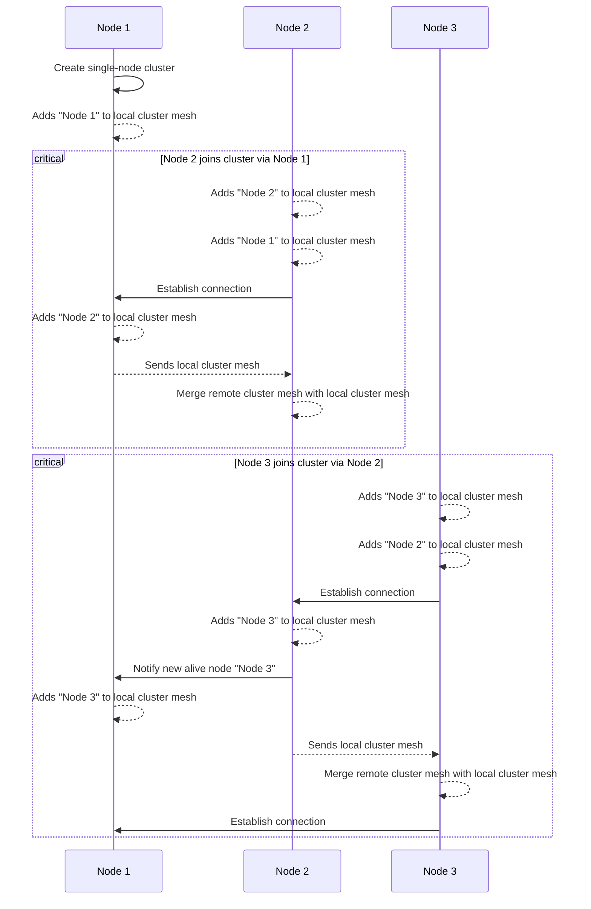

# Architecture

## Bootstrap

When starting FlowG, it sets up a single-node cluster automatically. Every node
in the cluster needs a unique identifier. If none is given, a random one will be
generated.

Once a node joins the cluster, the cluster mesh is updated on every node of the
cluster. Replication then happens in the background via the management
interface.

Here is a diagram of the bootstrap process:



## Transport Endpoints

The protocol is provided on top of FlowG's HTTP management interface:

<fieldset>
<legend>Cluster Status</legend>

**Description:** Return the currently known local cluster mesh.

```
GET /cluster/nodes
```

| Response | When |
| --- | --- |
| 200 OK | On success |
| 500 Internal Server Error | On failure |

**Example:**

```json
{
  "nodes": [
    {
      "node-id": "flowg-node0",
      "endpoint": "http://<private ip address>:9113"
    },
    {
      "node-id": "flowg-node1",
      "endpoint": "http://<private ip address>:9114"
    },
    {
      "node-id": "flowg-node2",
      "endpoint": "http://<private ip address>:9115"
    }
  ]
}
```

</fieldset>

<fieldset>
<legend>Gossip (Packet mode)</legend>

**Description:** Endpoint used by the *SWIM* protocol to exchange notifications.

```
POST /cluster/gossip
Origin: <node endpoint url>
X-FlowG-ClusterKey: <optional cluster cookie>
```

| Response | When |
| --- | --- |
| 202 Accepted | On success |
| 400 Bad Request | The `Origin` header identifying the node who originated the request |
| 401 Unauthorized | The node requires authentification, and the `X-FlowG-ClusterKey` header was invalid |
| 500 Internal Server Error | On failure |

</fieldset>

<fieldset>
<legend>Gossip (stream mode)</legend>

**Description:** Bidirectional endpoint used by the *SWIM* protocol to exchange
data.

```
POST /cluster/gossip
Upgrade: flowg
X-FlowG-ClusterKey: <optional cluster cookie>
```

| Response | When |
| --- | --- |
| 101 Switching Protocols | The connection has been accepted, and the socket will be used for bi-directional exchange |
| 501 Not Implemented | The server does not support hijacking the socket, maybe there is a Reverse Proxy in between? |
| 401 Unauthorized | The node requires authentification, and the `X-FlowG-ClusterKey` header was invalid |
| 500 Internal Server Error | On failure |

</fieldset>

<fieldset>
<legend>Authentication Database synchronization</legend>

**Description:** Endpoint used to receive incremental backups from other nodes.

```
POST /cluster/sync/auth
X-FlowG-ClusterKey: <optional cluster cookie>
X-FlowG-NodeID: <remote node ID>
Transfer-Encoding: chunked
Trailer: X-FlowG-Since

... incremental backup data ...

X-FlowG-Since: <new version>
```

| Response | When |
| --- | --- |
| 401 Unauthorized | The node requires authentification, and the `X-FlowG-ClusterKey` header was invalid |
| 400 Bad Request | Missing HTTP header `X-FlowG-NodeID` or invalid data in HTTP trailer `X-FlowG-Since` |
| 500 Internal Server Error | On failure |

</fieldset>

<fieldset>
<legend>Configuration database synchronization</legend>

**Description:** Endpoint used to receive incremental backups from other nodes.

```
POST /cluster/sync/config
X-FlowG-ClusterKey: <optional cluster cookie>
X-FlowG-NodeID: <remote node ID>
Transfer-Encoding: chunked
Trailer: X-FlowG-Since

... incremental backup data ...

X-FlowG-Since: <new version>
```

| Response | When |
| --- | --- |
| 401 Unauthorized | The node requires authentification, and the `X-FlowG-ClusterKey` header was invalid |
| 400 Bad Request | Missing HTTP header `X-FlowG-NodeID` or invalid data in HTTP trailer `X-FlowG-Since` |
| 500 Internal Server Error | On failure |

</fieldset>

<fieldset>
<legend>Log database synchronization</legend>

**Description:** Endpoint used to receive incremental backups from other nodes.

```
POST /cluster/sync/log
X-FlowG-ClusterKey: <optional cluster cookie>
X-FlowG-NodeID: <remote node ID>
Transfer-Encoding: chunked
Trailer: X-FlowG-Since

... incremental backup data ...

X-FlowG-Since: <new version>
```

| Response | When |
| --- | --- |
| 401 Unauthorized | The node requires authentification, and the `X-FlowG-ClusterKey` header was invalid |
| 400 Bad Request | Missing HTTP header `X-FlowG-NodeID` or invalid data in HTTP trailer `X-FlowG-Since` |
| 500 Internal Server Error | On failure |

</fieldset>
