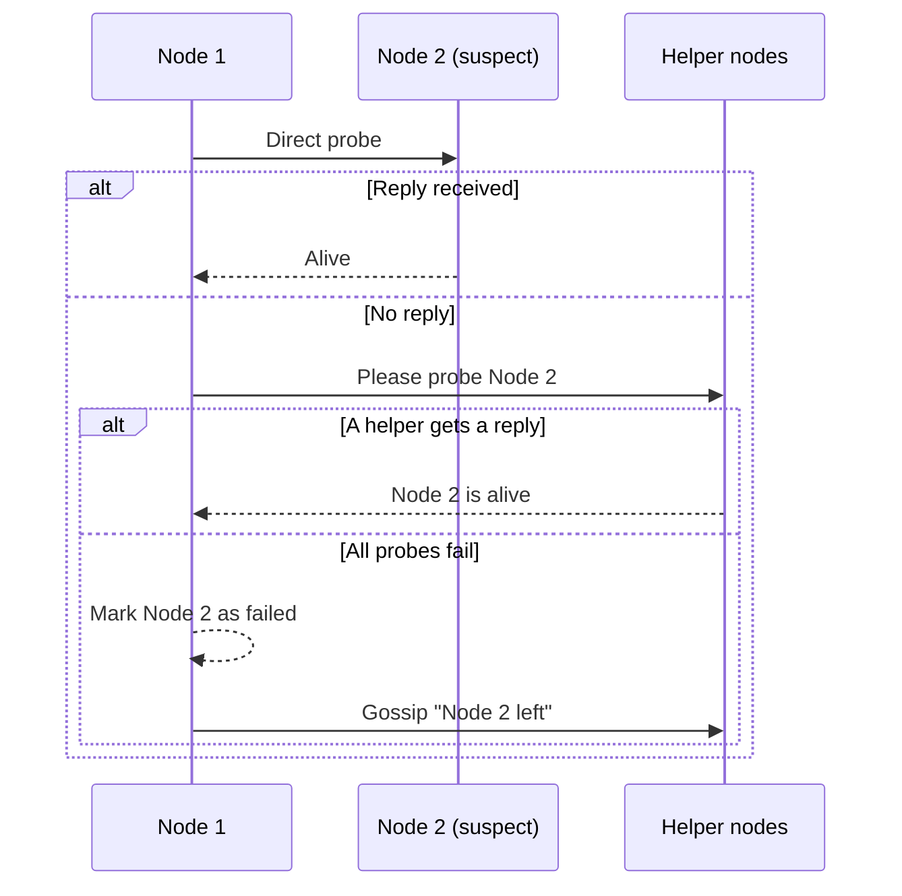

# Consensus

**FlowG** rely on the [SWIM Protocol](https://en.wikipedia.org/wiki/SWIM_Protocol)
(stands for *Scalable Weakly Consistent Infection-style Process Group Membership*)
for node discovery.

It is a "gossip" protocol that enables nodes to join and leave the cluster and
become aware of eachother.

In terms of the [CAP theorem](https://en.wikipedia.org/wiki/CAP_theorem), *SWIM*
is "AP", it sacrifices **strong consistency** for **availability** and
**partitioning tolerance**.

> **NB:** FlowG achieves **eventual consistency** by periodically streaming
> BadgerDB key/value pairs between nodes. For more information, consult
> [this page](./replication).

## Membership and failure detection

Nodes periodically *probe* a random peer to check that it is still alive. If a
direct probe fails, the node asks a few other members to probe the suspect on its
behalf — this guards against false positives caused by a single bad link. Only if
every attempt fails is the node marked as failed, and that conclusion is then
gossiped to the rest of the cluster.

This membership information is what the [replication engine](./replication) uses
to know which peers to broadcast to and reconcile with.

## Why not Raft?

[Raft](https://raft.github.io) is a distributed consensus protocol. Unlike
FlowG's "SWIM+CRDT" architecture, it is (in terms of CAP theorem) "CP", it
favors **strong consistency** and **partitioning tolerance** over
**availability**.

*Raft* is a leader/follower protocol, it tries to elect a leader node. All
writes must be done on the leader node, which means:

 - when leader election fails, the cluster becomes unavailable
 - when a write is sent to a node, it must redirect it to the leader node,
   increasing latency
 - since all writes must be directed to a single node, its load increase
 - since all writes must have a quorum to be accepted (which implies
   back-and-forth between the leader and followers), performance can be degraded

High Availability and Performance are key concerns, which makes *Raft* not
suited for our usecase.

## Why not Paxos?

Similarly to *Raft*, [Paxos](https://en.wikipedia.org/wiki/Paxos_(computer_science))
protocols are (in terms of CAP theorem) "CP". Which means the cluster can become
unavailable.
