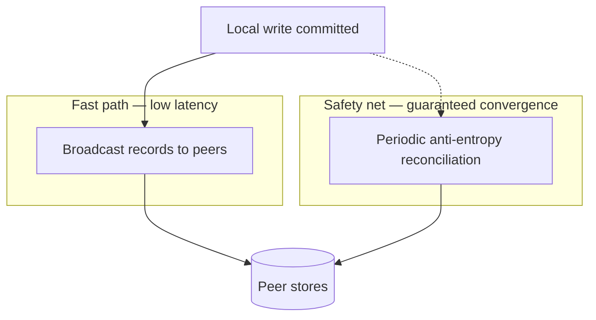
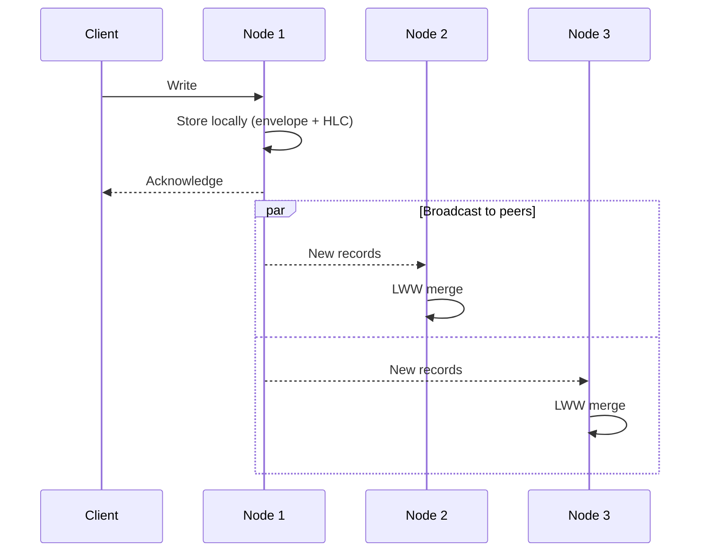
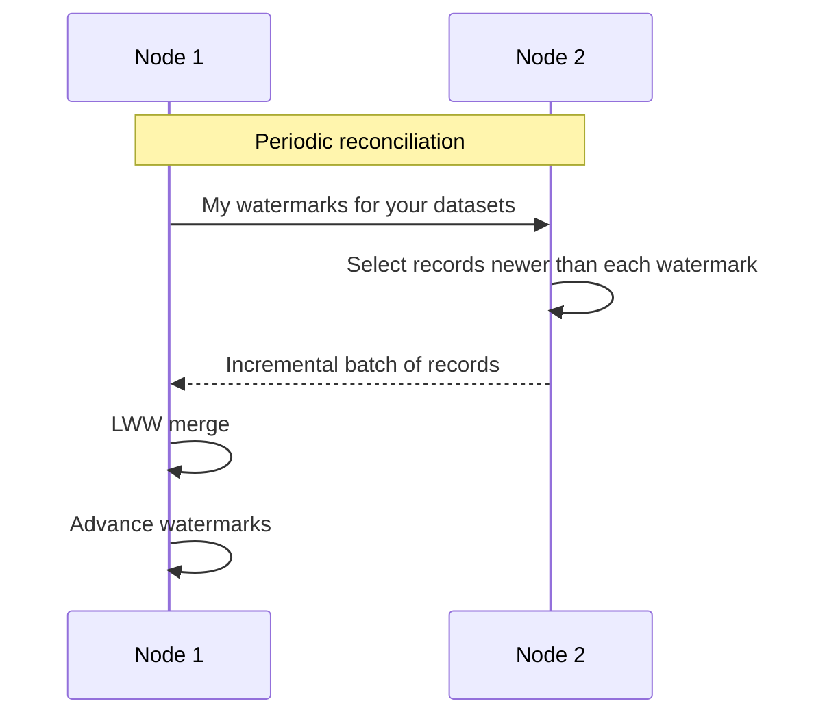
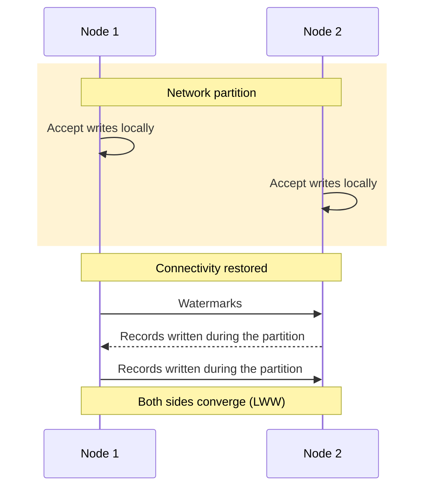
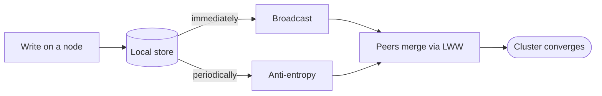

# Replication

  

  :construction: **EXPERIMENTAL** :construction:
  

  

    This feature is experimental and needs thorough testing before being
    production ready. 
    Please report any issues you encounter to the
    [GitHub issue tracker](https://github.com/link-society/flowg/issues).
  

## Introduction

**FlowG** favors **availability** and **partition tolerance** over strong
consistency (it is an "AP" system, see [Consensus](./consensus)). Every node
accepts writes locally and the cluster converges towards a shared state over
time — a model known as **eventual consistency**.

The foundation that makes this safe is described in
[How Data Is Replicated?](/docs/design/data-replication): every record is stored
in a **Last-Writer-Wins envelope** stamped with a **Hybrid Logical Clock**
timestamp. Because conflict resolution is deterministic and order-independent,
nodes can exchange records in any order, at any time, and still converge.

**FlowG** has 3 replicated datasets:

 - one for authentication and permissions
 - one for configuration (pipelines, transformers, ...)
 - one for the actual logs

Replication is achieved through **two complementary mechanisms**:

 - **Broadcast** propagates fresh writes immediately, for low latency.
 - **Anti-entropy** periodically reconciles nodes, catching anything a broadcast
   may have missed.

Neither mechanism needs the other to be correct: broadcast makes replication
*fast*, anti-entropy makes it *guaranteed*.

## Broadcast (fast path)

When a node commits a write, it immediately gossips the freshly written records
to the rest of the cluster. Peers merge them into their local store using the
Last-Writer-Wins rule. This keeps replication latency low under normal
conditions.

Broadcast is **best-effort**: a message may be lost, or a node may be temporarily
unreachable (for example during a network partition). On its own it is therefore
not enough to guarantee that every node eventually holds every record — which is
why it is paired with anti-entropy.

## Anti-entropy (safety net)

Periodically, each node reconciles its datasets with the other members of the
cluster. To avoid re-sending data that a peer already has, every node keeps track
— for each peer and each dataset — of **how much of that peer's data it has
already received**. We call this position a **watermark**.

During reconciliation, a node shares its watermarks; each peer then sends back
only the records written **after** that position. This makes synchronization
**incremental**: steady-state reconciliation is cheap, and a node that has fallen
behind (or just joined) receives exactly the tail of history it is missing —
starting from the very beginning on first contact.

Because merges are conflict-free, a watermark only needs to be an *optimization*:
even if a record is delivered more than once, applying it again is harmless.

### Recovering from a partition

Anti-entropy is what allows the cluster to heal after nodes have been isolated
from each other. While partitioned, each side keeps accepting writes locally.
When connectivity is restored, the next reconciliation exchanges everything that
diverged, and Last-Writer-Wins deterministically settles any conflicting updates.

## Putting it together

The diagram below summarizes how a single write reaches the rest of the cluster
through both paths:

The concrete HTTP endpoints used to carry broadcasts and synchronization batches
between nodes are documented in the [Architecture](./architecture) page.

