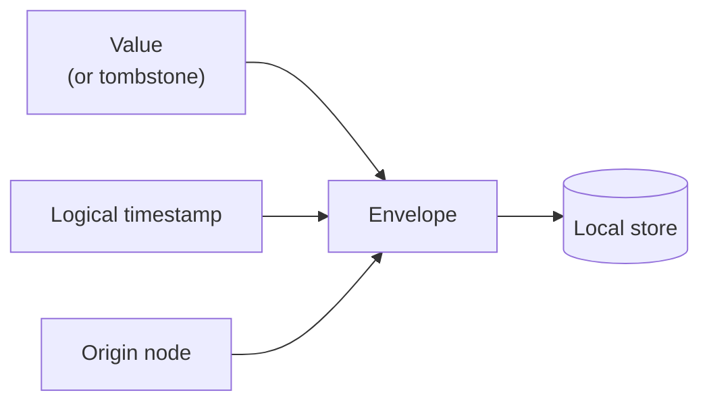
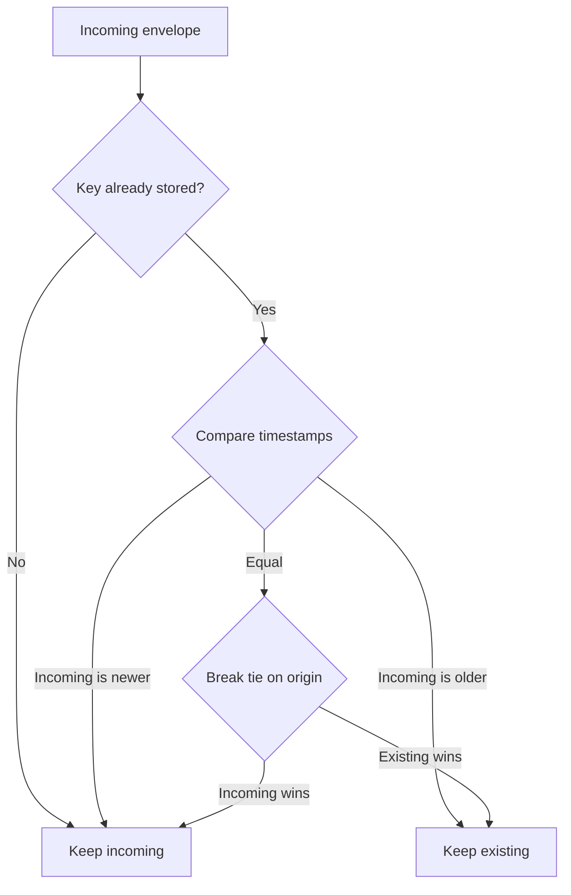
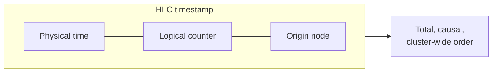
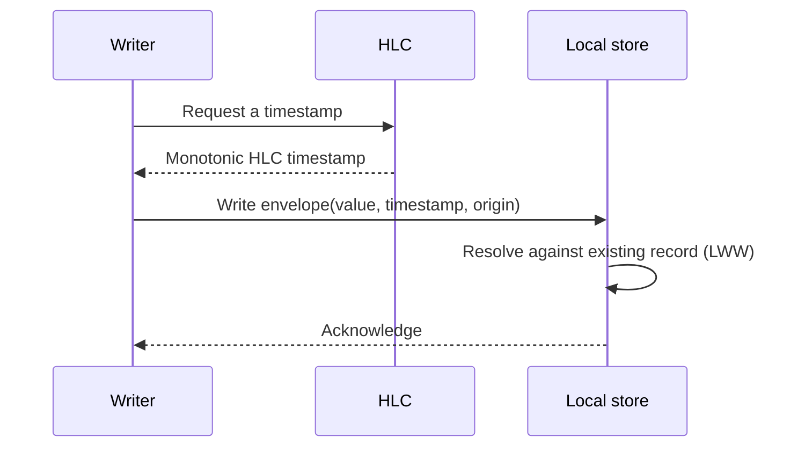

# How Data Is Replicated?

**FlowG** is a *multi-writer* system: there is no leader, no primary, and no
follower. Every node accepts reads **and** writes at any time, and the cluster
converges towards a single, shared state.

To make that possible, two nodes must be able to accept conflicting writes to the
same piece of data — independently, possibly while partitioned from each other —
and still agree on a final value once they exchange information. This page
describes the **local** building blocks that guarantee this convergence:

 - the **Last-Writer-Wins (LWW) envelope**, which decides *who wins* a conflict
 - the **Hybrid Logical Clock (HLC)**, which decides *which write came last*

:::info
This page only covers how a single node stores data so that it can later be
reconciled. For how these records actually travel between nodes — broadcast,
anti-entropy and incremental synchronization — see
[Replication](/docs/design/clustering/replication).
:::

## Why an envelope?

Imagine two nodes, disconnected from each other, both updating the same user's
password. When they reconnect, the cluster must pick **one** of the two values —
and, crucially, *every* node must pick the **same** one, regardless of the order
in which they learned about each write.

To achieve this, **FlowG** never stores a bare value. Instead, every record is
wrapped in an **envelope** that carries the metadata needed to resolve conflicts:

 - the **value** itself — or a **tombstone** marker when the record was deleted
 - a **logical timestamp** describing when the write happened (an HLC, see below)
 - the **origin**: the identity of the node that produced the write

For most records, the value is opaque to the replication layer: it does not
matter whether it is a pipeline definition, a user account or a stream's
configuration — they are all treated as envelopes.

The **log entries** themselves are the one deliberate exception. They are
written append-only, in very large volumes, and are never updated in place, so
wrapping each one in an envelope would add overhead for no benefit. Log entries
are therefore stored as **raw, immutable records**: there is no conflict to
resolve, and the rare case of *removing* them is handled at a coarser
granularity (see [Deletions and tombstones](#deletions-and-tombstones)).

## Last-Writer-Wins resolution

When two envelopes describe the same key, the conflict is resolved by comparing
their logical timestamps: **the most recent write wins**. A deletion is just an
envelope like any other, so a recent delete can override an older write, and an
even more recent write can override that delete.

Because the timestamps provide a **total order** (ties are broken
deterministically using the origin node's identity), this decision has three
essential properties:

 - **Commutative** — merging A then B yields the same result as B then A.
 - **Associative** — the grouping of merges does not matter.
 - **Idempotent** — receiving the same envelope twice changes nothing.

These are exactly the properties of a *Conflict-free Replicated Data Type*
(CRDT). They mean nodes can exchange envelopes **in any order, at any time, any
number of times**, and still arrive at an identical state. This is what makes
**eventual consistency** possible without any coordination.

## Deletions and tombstones

A naive delete — simply removing a key — would be unsafe in a distributed
system: a node that never heard about the deletion would happily re-share the old
value, "resurrecting" it.

To avoid this, deletions are stored as **tombstones**: envelopes that mark the
key as deleted while still carrying a timestamp. A tombstone can win or lose a
conflict just like a normal value. Tombstones are retained long enough for every
node to converge, after which they can be safely garbage-collected. How long they
are kept — the **grace period** — bounds how long a disconnected node can safely
rejoin and keep its offline writes, as explained in
[The safe-recovery window](/docs/design/clustering/replication#the-safe-recovery-window).

### Removing log entries

Because log entries are stored raw rather than as envelopes, they carry no
individual tombstone. They only ever disappear in two ways:

 - **Retention expiry** — each entry is written with a lifetime, and every node
   expires it independently. This needs no coordination: the removal is not a
   conflicting write, it is the same rule applied identically everywhere.
 - **Purging a whole stream** — recorded as a tombstone on the stream's
   *configuration*, which **is** an envelope. Applying that single tombstone
   then cascades to every one of the stream's log entries. The mechanics of that
   cascade are described in
   [Purging a stream](/docs/design/clustering/replication#purging-a-stream).

## Why a Hybrid Logical Clock?

The whole model hinges on being able to tell *which of two writes came last*. The
obvious candidate — the machine's wall-clock — is not reliable across nodes:

| Clock | Problem |
| --- | --- |
| **Physical (wall-clock)** | Clocks drift between machines and can even jump backwards (NTP corrections, VM pauses). Comparing them across nodes can violate causality. |
| **Logical (Lamport)** | Preserves causality but loses any link to real time, making it impossible to reason about time-based features such as log retention. |

A **Hybrid Logical Clock** combines the best of both. Each timestamp pairs a
**physical time** component with a **logical counter**:

 - It stays very close to real wall-clock time, so it remains meaningful for
   time-based features.
 - The logical counter advances whenever the physical clock does not move forward
   (or moves backwards), guaranteeing that timestamps are **strictly monotonic**.
 - When a node observes a higher timestamp coming from a peer, it pulls its own
   clock forward, keeping causally-related events correctly ordered cluster-wide.

To compare two timestamps, **FlowG** looks at the physical time first, then the
logical counter, and finally the origin node identity as a last-resort
tie-breaker — ensuring any two distinct writes are always orderable.

## The local write path

Putting it together, every write performed on a node follows the same steps,
whether it originated from a user request or from data received from a peer:

Because the stored records are self-describing envelopes, and because resolution
is deterministic and order-independent, the local store is always ready to be
reconciled with any other node — which is precisely what the
[replication process](/docs/design/clustering/replication) does.
