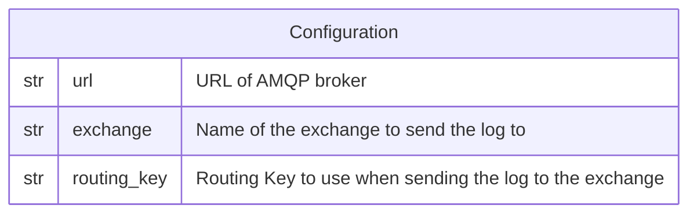

# AMQP

This forwarder is used to send a log record to an AMQP broker, such as
[RabbitMQ](http://rabbitmq.com/).

## Data Model



*Notes:*

1. The token is **NOT** encrypted in the database.

## Behavior

```go
payload, err := json.Marshal(logRecord)

conn, err := amqp.Dial(url)
ch, err := conn.Channel()
err = ch.Publish(
  exchange,
  routingKey,
  /* mandatory= */ false,
  /* immediate= */ false,
  amqp.Publishing{
    ContentType: "application/json",
    Body:        payload,
  },
)
```
