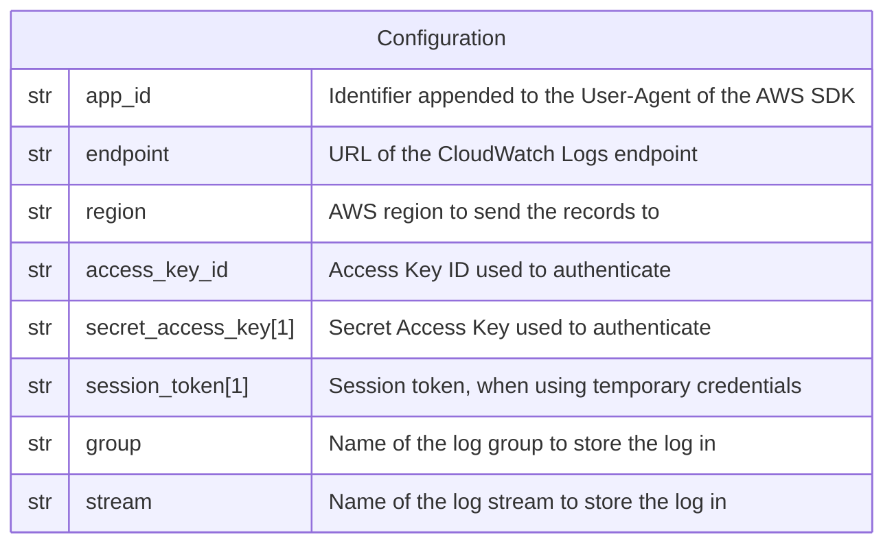

# AWS CloudWatch

This forwarder is used to send a log record to an
[AWS CloudWatch Logs](https://docs.aws.amazon.com/AmazonCloudWatch/latest/logs/WhatIsCloudWatchLogs.html)
stream.

## Data Model



:::note

1. The secret access key and the session token are **NOT** encrypted in the
   database.
2. The log group and the log stream must exist prior to sending records, they
   are not created by the forwarder.

:::

## Behavior

```go
client := cloudwatchlogs.New(cloudwatchlogs.Options{
  AppID:        appID,
  BaseEndpoint: &endpoint,
  Credentials:  credentials.NewStaticCredentialsProvider(
    accessKeyID,
    secretAccessKey,
    sessionToken,
  ),
  Region: region,
})

message, err := json.Marshal(logRecord.Fields)
// ...

_, err = client.PutLogEvents(ctx, &cloudwatchlogs.PutLogEventsInput{
  LogEvents: []types.InputLogEvent{
    {
      Message:   new(string(message)),
      Timestamp: new(logRecord.Timestamp.UnixMilli()),
    },
  },
  LogGroupName:  &group,
  LogStreamName: &stream,
})
// ...
```
