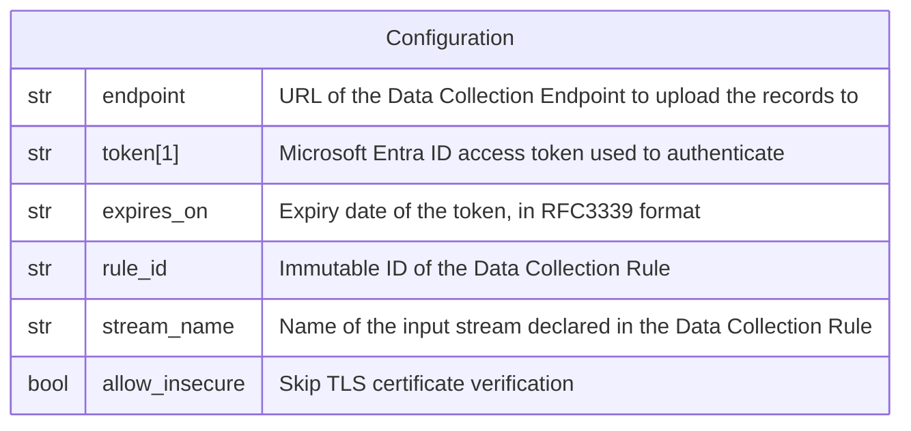

# Azure Monitor

This forwarder is used to send a log record to
[Azure Monitor Logs](https://learn.microsoft.com/en-us/azure/azure-monitor/logs/data-platform-logs),
via the
[Logs Ingestion API](https://learn.microsoft.com/en-us/azure/azure-monitor/logs/logs-ingestion-api-overview).

## Data Model



:::note

1. The token is **NOT** encrypted in the database. FlowG does not renew it
   either: the forwarder must be reconfigured with a fresh token before it
   expires.
2. The Data Collection Rule, its input stream and the destination table must
   exist prior to sending records, they are not created by the forwarder.
3. `allow_insecure` disables TLS certificate verification, it is meant to
   target a local emulator or a test server, it should not be used against
   the Azure Monitor API.

:::

## Behavior

```go
expiresOn, err := time.Parse(time.RFC3339, expiresOnStr)
// ...

credential := staticTokenCredential{
  token:     token,
  expiresOn: expiresOn,
}

client, err := azlogs.NewClient(endpoint, credential, &azlogs.ClientOptions{
  ClientOptions: azcore.ClientOptions{
    Transport: &http.Client{
      Transport: &http.Transport{
        TLSClientConfig: &tls.Config{
          InsecureSkipVerify: allowInsecure,
        },
      },
    },
  },
})
// ...

message, err := json.Marshal([]map[string]string{logRecord.Fields})
// ...

_, err = client.Upload(ctx, ruleID, streamName, message, nil)
// ...
```
