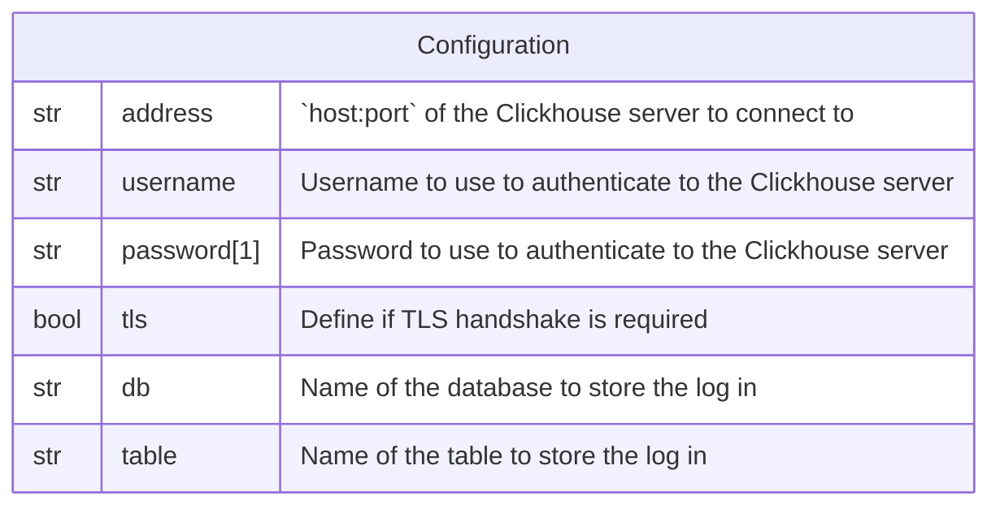

# Clickhouse

This forwarder is used to persist a log record in an
[Clickhouse](https://clickhouse.com) table.

> **NB:** If the target table does not exist, it will be created.

## Data Model



*Notes:*

1. The password is **NOT** encrypted in the database.

## Behavior

```sql
CREATE TABLE IF NOT EXISTS `table` (
	id         UUID                 NOT NULL PRIMARY KEY,
	timestamp  DateTime64(3, 'UTC') NOT NULL,
	fields     Map(String, String)  NOT NULL,
) ENGINE = MergeTree;

INSERT INTO `table`
VALUES (`uuidv4`, `logRecord.timestamp`, `logRecord.fields`);
```
