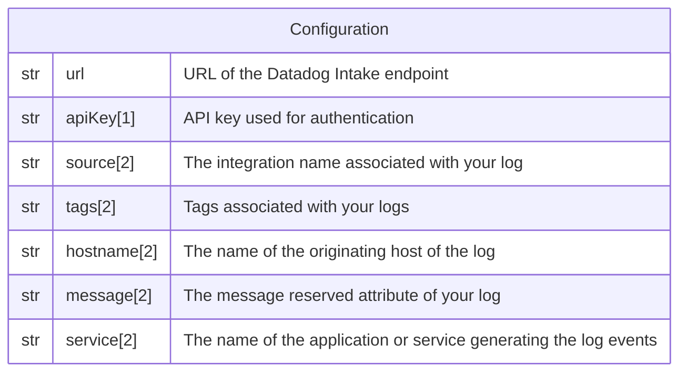

# Datadog

This forwarder is used to send a log record to [Datadog](http://datadoghq.com/).

## Data Model



*Notes:*

1. The key is **NOT** encrypted in the database.
2. Those fields are "dynamic", consult
   [this page](/docs/technical/dynamic-fields) for more information.
3. For more information about Datadog parameters visit [this page](https://docs.datadoghq.com/api/latest/logs/#send-logs)

## Behavior

```
POST <URL>
Accept: application/json
Content-Type: application/json
DD-API-KEY: <APIKEY>

{
  "ddtags": "<log.ddtags>",
  "ddsource": "<log.ddsource>",
  "hostname": "<log.hostname>",
  "service": "<log.service>",
  "message": "<log.message>",
}
```
