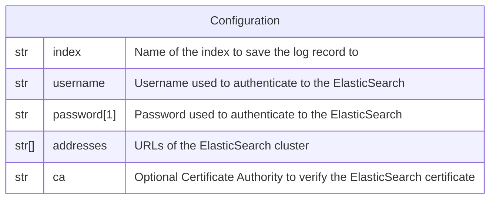

# ElasticSearch

This forwarder is used to persist a log record in an
[ElasticSearch](https://www.elastic.co/elasticsearch) index.

> **NB:** If the target index does not exist, it will be created.

## Data Model



*Notes:*

1. The password is **NOT** encrypted in the database.

## Behavior

```go
cfg := elasticsearch.Config{
  Username:  username,
  Password:  password,
  Addresses: addresses,
  CACert:    ca,
}
client, err := elasticsearch.NewClient(cfg)
// ...

resp, err := client.Indices.Exists(
  []string{index},
  client.Indices.Exists.WithContext(ctx),
)
if resp.StatusCode == 404 {
  resp, err := client.Indices.Create(
    index,
    client.Indices.Create.WithContext(ctx),
  )
  // ...
}
// ...

resp, err = client.Index(
  index,
  logRecord,
  client.Index.WithContext(ctx),
)
// ...
```
