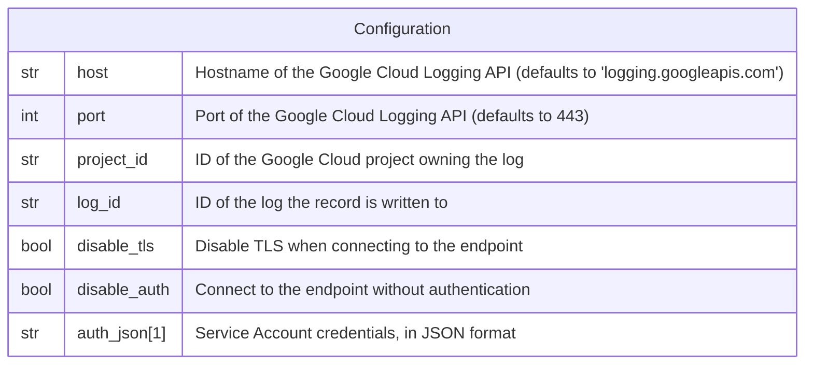

# Google Cloud Logging

This forwarder is used to send a log record to
[Google Cloud Logging](https://cloud.google.com/logging).

## Data Model



:::note

1. The credentials are **NOT** encrypted in the database.
2. `disable_tls` and `disable_auth` are meant to target a local emulator
   or a test server, they should not be used against the Google Cloud Logging
   API.

:::

## Behavior

```go
opts := []option.ClientOption{
  option.WithEndpoint(host + ":" + strconv.Itoa(port)),
}

if len(authJSON) > 0 {
  opts = append(opts, option.WithAuthCredentialsJSON(
    option.ServiceAccount,
    []byte(authJSON),
  ))
}

if disableAuth {
  opts = append(opts, option.WithoutAuthentication())
}

if disableTLS {
  opts = append(opts, option.WithGRPCDialOption(
    grpc.WithTransportCredentials(insecure.NewCredentials()),
  ))
}

client, err := logging.NewClient(ctx, projectID, opts...)
// ...

logger := client.Logger(logID)

payload, err := json.Marshal(logRecord.Fields)
// ...

err = logger.LogSync(ctx, logging.Entry{
  Timestamp: logRecord.Timestamp,
  Payload:   json.RawMessage(payload),
})
// ...
```
