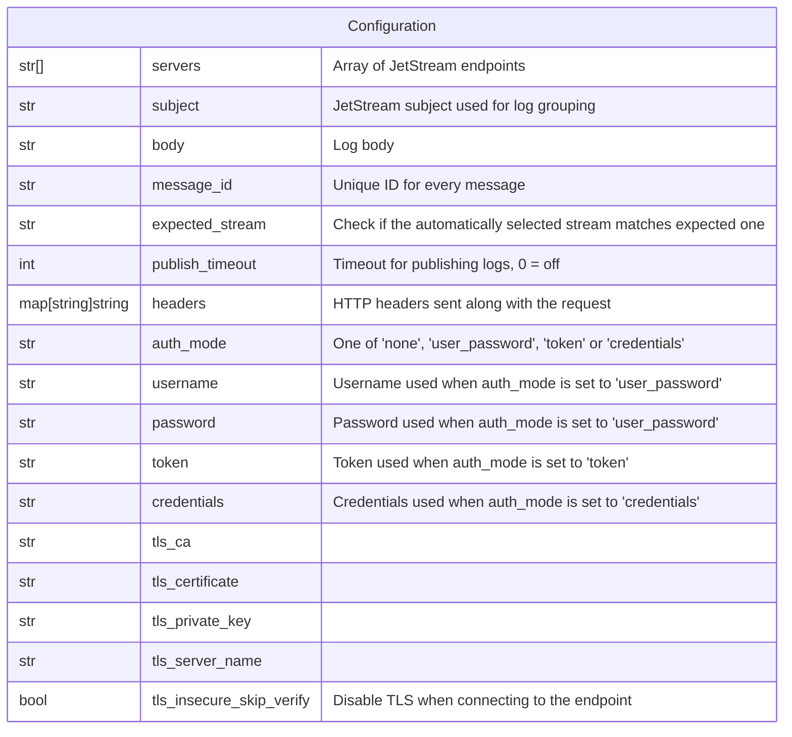

# NATS JetStream

This forwarder is used to send a log record to
[NATS JetStream](https://docs.nats.io/concepts/jetstream).

## Data Model



:::note

1. The credentials are **NOT** encrypted in the database.
2. `auth mode: none` and `tls_insecure_skip_verify` are meant to target a local emulator
   or a test server, they should not be used against the Google Cloud Logging
   API.

:::

## Behavior

```go
opts := nats.Options{
	Servers: rt.config.Servers,
	Secure:  !rt.config.TlsInsecureSkipVerify,
	TLSConfig: new(tls.Config{
		ServerName:         rt.config.TlsServerName,
		InsecureSkipVerify: rt.config.TlsInsecureSkipVerify,
	}),
	Token:   rt.config.Token,
}

if rt.config.PublishTimeout > 0 {
	opts.Timeout = time.Duration(rt.config.PublishTimeout)*time.Second
}

switch rt.config.AuthMode {
case "user_password":
	opts.User = rt.config.Username
	opts.Password = rt.config.Password
case "token":
	opts.Token = rt.config.Token
case "credentials":
	userJWT = jwt.ParseDecoratedJWT([]byte(rt.config.Credentials))
	keyPair = nkeys.ParseDecoratedNKey([]byte(rt.config.Credentials))
}

if len(rt.config.TlsCertificate) > 0 {
	clientCAs := x509.NewCertPool()
    clientCAs.AppendCertsFromPEM([]byte(rt.config.TlsCertificate))

	opts.TLSConfig.ClientAuth = tls.RequireAndVerifyClientCert
	opts.TLSConfig.ClientCAs = clientCAs
}

if len(rt.config.TlsCA) > 0 {
	clientCert, err := tls.X509KeyPair(
		[]byte(rt.config.TlsCA),
		[]byte(rt.config.TlsPrivateKey),
	)
 
	opts.TLSConfig.Certificates = append(opts.TLSConfig.Certificates, clientCert)
}

rt.connection = opts.Connect()
rt.client = jetstream.New(rt.connection)
```
