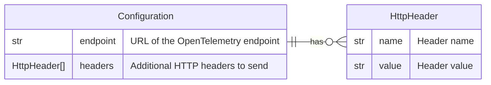

# OpenTelemetry

This forwarder is used to send a log record to an OpenTelemetry HTTP endpoint
(using the Protobuf serialization).

## Data Model



## Behavior

```
POST http://example.com
Content-Type: application/x-protobuf
```

```python
LogData(
  resource_logs=[
    ResourceLog(
      scope_logs=[
        ScopeLogs(
          log_records=[
            LogRecord(
              time_unix_nano=log_record.timestamp,
              body=log_record.fields["body"],
              attributes=[
                KeyValue(key=k, value=v)
                for k, v in log_record.fields
                if k != "body"
              ],
            ),
          ],
        ),
      ],
    )
  ],
)
```
