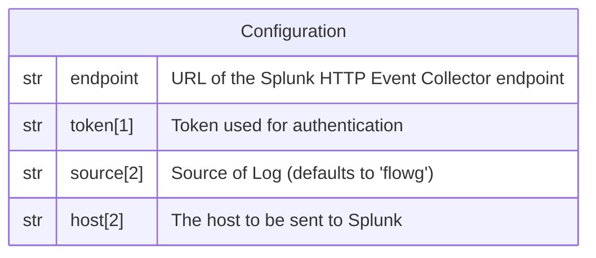

# Splunk

This forwarder is used to send a log record to [Splunk](http://splunk.com/).

## Data Model



*Notes:*

1. The token is **NOT** encrypted in the database.
2. These fields are "dynamic", consult
   [this page](/docs/technical/dynamic-fields) for more information.

## Behavior

```
POST <ENDPOINT>
Authorization: Splunk <TOKEN>
Content-Type: application/json

{
  "event": {
    "...": "...",
  },
  "sourcetype": "json",
  "source": "<log.source>",
  "host": "<log.host>",
  "time": "<timestamp>",
}
```
