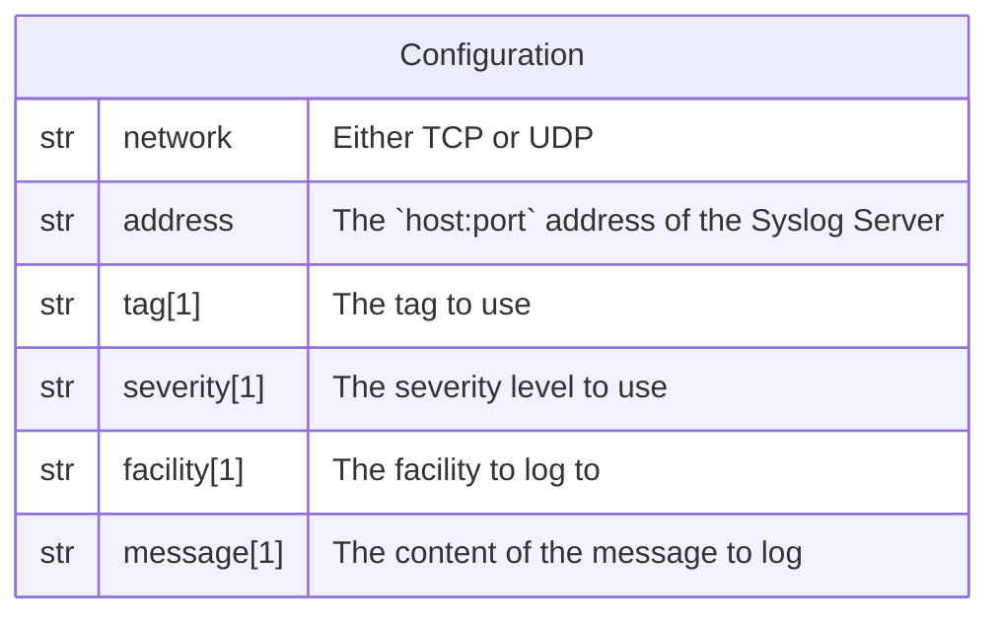

# Syslog

This forwarder is used to send a log record to a remote Syslog Server.

## Data Model



*Notes:*

1. Those fields are "dynamic", consult
[this page](/docs/technical/dynamic-fields) for more information.

## Behavior

```go
priority := severity | facility
writer, err := syslog.Dial(network, address, priority, tag)
// ...
err = writer.Write(message)
// ...
```
