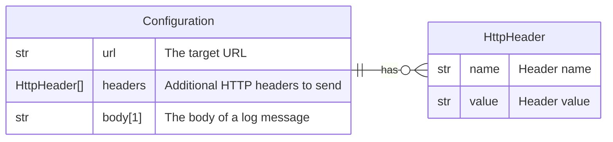

# Webhook

This forwarder is used to send a log record to an HTTP endpoint using a POST
request.

## Data Model



*Notes: *

1. This field is "dynamic", consult
   [this page](/docs/technical/dynamic-fields) for more information.

## Behavior

```
POST http://example.com
{
  "timestamp": "...",
  "fields": {
    "...": "..."
  }
}
```
