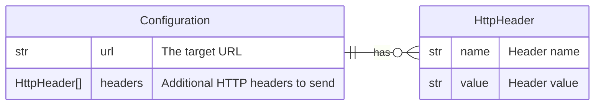

# Webhook

This forwarder is used to send a log record to an HTTP endpoint using a POST
request.

## Data Model



## Behavior

```
POST http://example.com
{
  "timestamp": "...",
  "fields": {
    "...": "..."
  }
}
```
