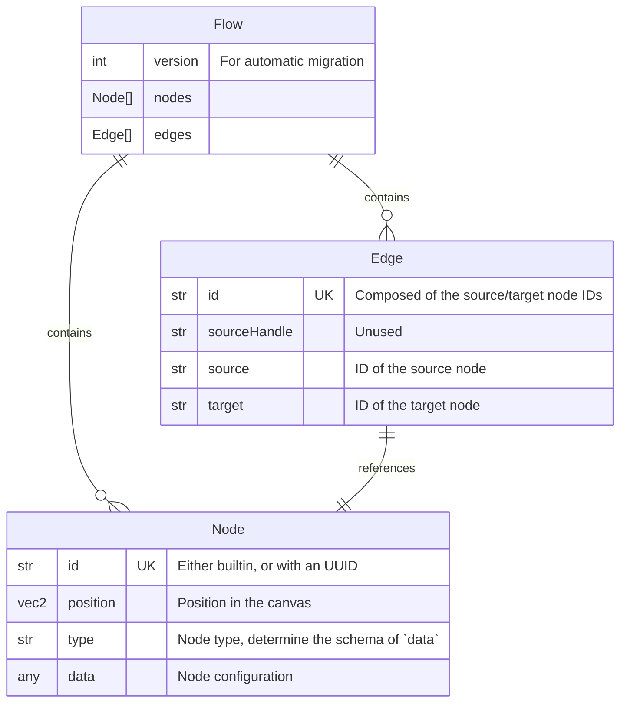

# Pipelines

A pipeline is a flow-based graph through which log records are processed.

Logs can be ingested via the HTTP API, or via the embedded Syslog Server. As
such, every pipeline has 2 entrypoints, but can have many termination nodes.

## Data Model

