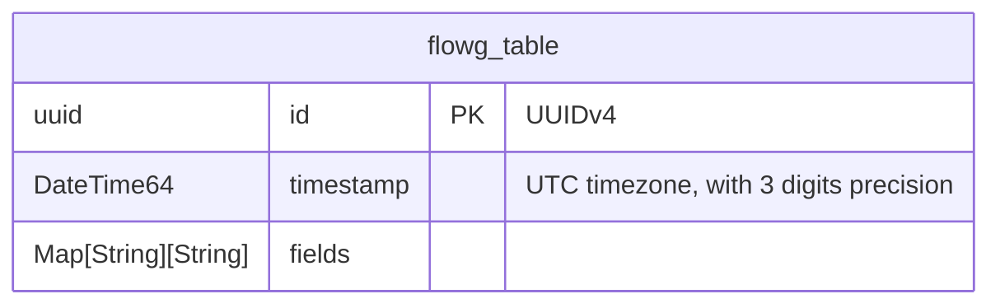

# Clickhouse

[Clickhouse](https://clickhouse.com/) is an open-source column-oriented DBMS
(columnar database management system) for online analytical processing (OLAP)
that allows users to generate analytical reports using SQL queries in
real-time.

# Setting up Clickhouse

The fastest way to set up Clickhouse for testing is to use a docker container:
```sh
docker run \
	-p 9000:9000 \
	--name some-clickhouse-server \
	--ulimit nofile=262144:262144 \
	-e CLICKHOUSE_USER=user \
	-e CLICKHOUSE_PASSWORD=pass \
	clickhouse/clickhouse-server
```

## Setting up the FlowG pipeline
import ForwarderClickhouseUrl from '@site/static/img/guides/clickhouse/forwader-clickhouse-form.png'
import PipelineWithClickhouseUrl from '@site/static/img/guides/clickhouse/pipeline-with-clickhouse.png'

First, let's create a "Clickhouse Forwarder" named `clickhouse`, with the
following configuration:

| Property                      | Value            | Comment                                                          |
| ---                           | ---              | ---                                                              |
| Clickhouse connection address | `localhost:9000` | The Clickhouse client endpoint                                   |
| Database name                 | `default`        | The default database created in the container                    |
| Table name                    | `default`        | The table name to use for the logs                               |
| Database username             | `user`           | The name of the user specified in the command                    |
| Database password             | `pass`           | The password of the user specified in the command                |
| Use TLS                       | unchecked        | The container doesn't set up TLS, so, for testing, we disable it |

<div style={{ textAlign: 'center' }}>
  
</div>

Then, create a pipeline that forwards logs to the `clickhouse` forwarder:

<div style={{ textAlign: 'center' }}>
  
</div>

And that's it!

## Testing

You can test the setup by sending a log to the pipeline using the `logger` command:

```sh
logger -n localhost -P 5514 -t my-app 'hello world'
```

The log will be forwarded to your Clickhouse instance and stored in the
specified table.

To query the clickhouse instance for the logs, run the following command:

```sh
docker exec some-clickhouse-server clickhouse-client 'select * from default order by timestamp;'
```

## Data model in Clickhouse

Table schema:

```sql
CREATE TABLE IF NOT EXISTS tablename (
	id         UUID                 NOT NULL PRIMARY KEY,
	timestamp  DateTime64(3, 'UTC') NOT NULL,
	fields     Map(String, String)  NOT NULL,
) ENGINE = MergeTree

```


