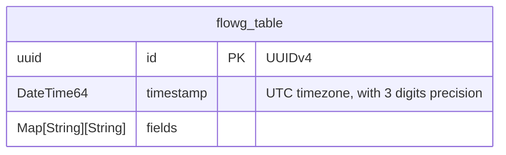

# Clickhouse

[Clickhouse](https://clickhouse.com/) is an open-source column-oriented DBMS
(columnar database management system) for online analytical processing (OLAP)
that allows users to generate analytical reports using SQL queries in
real-time.

# Setting up Clickhouse

The fastest way to set up Clickhouse for testing is to use a docker container:
```sh
docker run \
	-p 9000:9000 \
	--name some-clickhouse-server \
	--ulimit nofile=262144:262144 \
	-e CLICKHOUSE_USER=user \
	-e CLICKHOUSE_PASSWORD=pass \
	clickhouse/clickhouse-server
```

## Setting up the FlowG pipeline
import ForwarderForm from '@site/src/components/ForwarderForm'
import PipelineDiagram from '@site/src/components/PipelineDiagram'

First, let's create a "Clickhouse Forwarder" named `clickhouse`, with the
following configuration:

<ForwarderForm
  forwarderType="Clickhouse"
  fields={[
    { label: 'Clickhouse Connection Address', value: 'localhost:9000', tooltip: 'The Clickhouse client endpoint.' },
    { label: 'Database Name', value: 'default', tooltip: 'The default database created in the container.' },
    { label: 'Table Name', value: 'default', tooltip: 'The table name to use for the logs.' },
    { label: 'Database Username', value: 'user', tooltip: 'The name of the user specified in the command.' },
    { type: 'password', label: 'Database Password', tooltip: 'The password of the user specified in the command.' },
    { type: 'divider' },
    { type: 'checkbox', label: 'Use TLS', checked: false, tooltip: "The container doesn't set up TLS, so for testing we disable it." },
  ]}
/>

Then, create a pipeline that forwards logs to the `clickhouse` forwarder:

<PipelineDiagram
  alt="A FlowG pipeline routing syslog logs to the Clickhouse forwarder"
  nodes={[
    { id: 'source', type: 'source', x: 0, y: 0, value: 'SYSLOG' },
    { id: 'fwd', type: 'forwarder', x: 340, y: 0, value: 'clickhouse' },
  ]}
  edges={[
    { from: 'source', to: 'fwd' },
  ]}
/>

And that's it!

## Testing

You can test the setup by sending a log to the pipeline using the `logger` command:

```sh
logger -n localhost -P 5514 -t my-app 'hello world'
```

The log will be forwarded to your Clickhouse instance and stored in the
specified table.

To query the clickhouse instance for the logs, run the following command:

```sh
docker exec some-clickhouse-server clickhouse-client 'select * from default order by timestamp;'
```

## Data model in Clickhouse

Table schema:

```sql
CREATE TABLE IF NOT EXISTS tablename (
	id         UUID                 NOT NULL PRIMARY KEY,
	timestamp  DateTime64(3, 'UTC') NOT NULL,
	fields     Map(String, String)  NOT NULL,
) ENGINE = MergeTree

```


